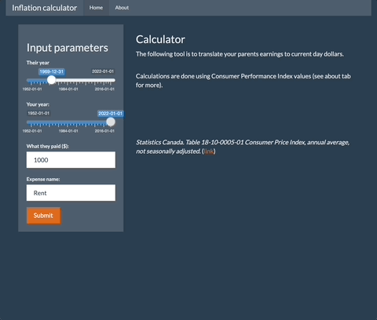

# inflation-calculator
R Shiny app calculator using Canada's Consumer Price Index (Statistics Canada).

Inspired by Ian Webster's website: "[$1 in 1941 → 2023 | Canada Inflation Calculator.](https://www.officialdata.org/canada/inflation/1941?amount=1)"

Resources:

Statistics Canada. Table 18-10-0005-01  Consumer Price Index, annual average, not seasonally adjusted

(CPI was exported from Stats Canada Website on 2023-09-23 from the link below and cleaned using R Markdown file `experiment.rmd`).

* https://www.officialdata.org/canada/inflation/2020?amount=1&endYear=2023
* https://www150.statcan.gc.ca/t1/tbl1/en/tv.action?pid=1810000501&pickMembers%5B0%5D=1.2&cubeTimeFrame.startYear=1952&cubeTimeFrame.endYear=2022&referencePeriods=19520101%2C20220101
